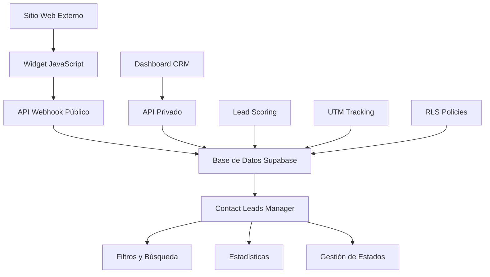

# Sistema de Contact Leads - FOMO Platform

## 📋 Índice
1. [Resumen del Sistema](#resumen-del-sistema)
2. [Arquitectura](#arquitectura)
3. [Base de Datos](#base-de-datos)
4. [APIs](#apis)
5. [Frontend Components](#frontend-components)
6. [Integración Web](#integración-web)
7. [Configuración](#configuración)
8. [Ejemplos de Uso](#ejemplos-de-uso)
9. [Testing](#testing)
10. [Troubleshooting](#troubleshooting)

## 🎯 Resumen del Sistema

El sistema de Contact Leads de FOMO Platform permite capturar, gestionar y procesar leads de contacto desde formularios web externos. Incluye:

- **Multi-tenant**: Aislamiento completo por empresa
- **Lead Scoring Automático**: Puntuación inteligente basada en múltiples factores
- **Tracking Completo**: UTM parameters, metadata técnica y de engagement
- **APIs Públicas y Privadas**: Para captura externa y gestión interna
- **Widget JavaScript**: Fácil integración en cualquier sitio web
- **Interface de Gestión**: Dashboard completo para administrar leads

## 🏗️ Arquitectura



### Componentes Principales

1. **Database Layer**: Tabla `contact_leads` con RLS multi-tenant
2. **Backend APIs**: Webhook público + API privado CRUD
3. **Frontend Components**: ContactLeadsManager React component
4. **Integration Tools**: Widget JavaScript + Formulario HTML
5. **Security**: RLS policies + Authentication
6. **Analytics**: Lead scoring + UTM tracking

## 🗄️ Base de Datos

### Tabla: `contact_leads`

```sql
CREATE TABLE contact_leads (
    id UUID PRIMARY KEY DEFAULT gen_random_uuid(),
    company_id UUID REFERENCES companies(id) ON DELETE CASCADE,
    
    -- Información básica del contacto
    name TEXT NOT NULL,
    email TEXT NOT NULL,
    company TEXT,
    website TEXT,
    phone TEXT,
    pain_point TEXT,
    notes TEXT,
    
    -- Información de marketing
    source TEXT,
    utm_source TEXT,
    utm_medium TEXT,
    utm_campaign TEXT,
    utm_term TEXT,
    utm_content TEXT,
    
    -- Metadata técnica
    user_agent TEXT,
    ip_address INET,
    referrer TEXT,
    page_url TEXT,
    
    -- Gestión del lead
    status lead_status DEFAULT 'new',
    priority lead_priority DEFAULT 'medium',
    lead_score INTEGER DEFAULT 0,
    assigned_to UUID REFERENCES auth.users(id),
    
    -- Fechas importantes
    follow_up_date TIMESTAMPTZ,
    contacted_at TIMESTAMPTZ,
    converted_at TIMESTAMPTZ,
    created_at TIMESTAMPTZ DEFAULT NOW(),
    updated_at TIMESTAMPTZ DEFAULT NOW()
);
```

### Enums

```sql
CREATE TYPE lead_status AS ENUM ('new', 'contacted', 'qualified', 'proposal', 'negotiation', 'closed_won', 'closed_lost');
CREATE TYPE lead_priority AS ENUM ('low', 'medium', 'high', 'urgent');
```

### Lead Scoring Automático

```sql
CREATE OR REPLACE FUNCTION calculate_lead_score(
    website_val TEXT,
    pain_point_val TEXT,
    source_val TEXT,
    company_val TEXT
) RETURNS INTEGER AS $$
DECLARE
    score INTEGER := 0;
BEGIN
    -- Base score
    score := 10;
    
    -- Website presence (+20 points)
    IF website_val IS NOT NULL AND website_val != '' THEN
        score := score + 20;
    END IF;
    
    -- Pain point quality
    IF pain_point_val IS NOT NULL THEN
        IF LENGTH(pain_point_val) > 50 THEN
            score := score + 15; -- Detailed pain point
        ELSIF LENGTH(pain_point_val) > 20 THEN
            score := score + 10; -- Medium detail
        ELSE
            score := score + 5; -- Basic info
        END IF;
    END IF;
    
    -- Source quality
    CASE source_val
        WHEN 'google_ads', 'linkedin' THEN score := score + 15;
        WHEN 'referral', 'website' THEN score := score + 10;
        WHEN 'facebook_ads', 'email' THEN score := score + 5;
        ELSE score := score + 2;
    END CASE;
    
    -- Company presence (+10 points)
    IF company_val IS NOT NULL AND company_val != '' THEN
        score := score + 10;
    END IF;
    
    RETURN LEAST(score, 100); -- Cap at 100
END;
$$ LANGUAGE plpgsql;
```

### RLS Policies

```sql
-- Companies can only see their own leads
CREATE POLICY "Companies can view own contact leads" ON contact_leads
    FOR SELECT USING (company_id = auth.jwt() ->> 'company_id'::text);

-- Companies can manage their own leads
CREATE POLICY "Companies can manage own contact leads" ON contact_leads
    FOR ALL USING (company_id = auth.jwt() ->> 'company_id'::text);

-- Public insert policy for webhook
CREATE POLICY "Allow public insert for contact leads" ON contact_leads
    FOR INSERT WITH CHECK (true);
```

## 🔌 APIs

### 1. API Webhook Público

**Endpoint**: `POST /api/webhook/contact-lead`

**Descripción**: Permite captura de leads desde formularios web externos sin autenticación.

**Headers**:
```http
Content-Type: application/json
```

**Request Body**:
```json
{
  "name": "Juan Pérez",
  "email": "juan@example.com",
  "company": "Mi Empresa SL",
  "website": "https://example.com",
  "phone": "+34 600 123 456",
  "pain_point": "Necesitamos optimizar nuestros procesos de ventas",
  "source": "google_ads",
  "utm_source": "google",
  "utm_medium": "cpc",
  "utm_campaign": "summer_2024",
  "user_agent": "Mozilla/5.0...",
  "referrer": "https://google.com"
}
```

**Response**:
```json
{
  "success": true,
  "lead": {
    "id": "uuid",
    "lead_score": 75,
    "priority": "high",
    "created_at": "2024-01-15T10:30:00Z"
  }
}
```

### 2. API Privado CRM

**Endpoint**: `/api/workspace/crm/contact-leads`

**Autenticación**: Requerida (JWT token)

#### GET - Listar Leads
```http
GET /api/workspace/crm/contact-leads?status=new&limit=20&page=1
```

**Query Parameters**:
- `status`: Filtrar por estado
- `source`: Filtrar por fuente
- `priority`: Filtrar por prioridad
- `assigned_to`: Filtrar por usuario asignado
- `search`: Búsqueda en nombre, email, empresa
- `from_date`, `to_date`: Rango de fechas
- `limit`, `page`: Paginación

#### POST - Crear Lead
```json
{
  "name": "María García",
  "email": "maria@empresa.com",
  "pain_point": "Problemas con gestión de inventario"
}
```

#### PUT - Actualizar Lead
```json
{
  "status": "contacted",
  "priority": "high",
  "assigned_to": "user-uuid",
  "notes": "Contactado por teléfono, interesado en demo"
}
```

#### DELETE - Eliminar Lead
```http
DELETE /api/workspace/crm/contact-leads/[id]
```

## ⚛️ Frontend Components

### ContactLeadsManager

**Ubicación**: `app/(workspace)/workspace/crm/leads/components/ContactLeadsManager.tsx`

**Características**:
- Lista de leads con filtros avanzados
- Estadísticas en tiempo real
- Gestión de estados y asignaciones
- Búsqueda y paginación
- Modal para editar leads

**Props**:
```typescript
interface ContactLeadsManagerProps {
  initialLeads?: ContactLead[];
  companyId: string;
}
```

**Uso**:
```tsx
import { ContactLeadsManager } from './components/ContactLeadsManager';

export default function LeadsPage() {
  return (
    <div>
      <ContactLeadsManager companyId={companyId} />
    </div>
  );
}
```

## 🌐 Integración Web

### 1. Widget JavaScript

**Archivo**: `public/fomo-lead-capture.js`

**Instalación Simple**:
```html
<script>
  window.FOMO_CONFIG = {
    apiEndpoint: 'https://your-domain.vercel.app/api/webhook/contact-lead',
    trigger: 'exit-intent',
    messages: {
      title: '¡Espera! Antes de que te vayas...',
      subtitle: 'Déjanos ayudarte con tu proyecto'
    }
  };
</script>
<script src="https://your-domain.vercel.app/fomo-lead-capture.js"></script>
```

**Configuración Avanzada**:
```javascript
window.FOMO_CONFIG = {
  apiEndpoint: 'https://your-domain.vercel.app/api/webhook/contact-lead',
  trigger: 'scroll', // 'exit-intent', 'scroll', 'time', 'manual'
  scrollThreshold: 70,
  timeDelay: 30000,
  position: 'center',
  theme: 'modern',
  fields: {
    name: { required: true, placeholder: 'Tu nombre completo' },
    email: { required: true, placeholder: 'tu@email.com' },
    company: { required: false, placeholder: 'Tu empresa' },
    pain_point: { required: true, placeholder: '¿Cuál es tu desafío?' }
  },
  styling: {
    primaryColor: '#667eea',
    backgroundColor: '#ffffff',
    borderRadius: '12px'
  }
};
```

**Triggers Disponibles**:
- `exit-intent`: Se muestra cuando el mouse sale del viewport
- `scroll`: Se activa al hacer scroll al X% de la página
- `time`: Se muestra después de X segundos
- `manual`: Se controla programáticamente

**Control Programático**:
```javascript
// Mostrar el widget manualmente
window.FOMO.show();

// Destruir el widget
window.FOMO.destroy();
```

### 2. Formulario HTML Standalone

**Archivo**: `public/contact-lead-form-example.html`

**Características**:
- Formulario completo listo para usar
- Validación del lado cliente
- Tracking automático de UTM
- Responsive design
- Datos de demo con Ctrl+D

## ⚙️ Configuración

### Variables de Entorno

```env
# Supabase
NEXT_PUBLIC_SUPABASE_URL=your_supabase_url
NEXT_PUBLIC_SUPABASE_ANON_KEY=your_anon_key
SUPABASE_SERVICE_ROLE_KEY=your_service_role_key

# Opcional: Para rate limiting
UPSTASH_REDIS_REST_URL=your_redis_url
UPSTASH_REDIS_REST_TOKEN=your_redis_token
```

### Configuración de Supabase

1. **Aplicar Migración**:
```sql
-- Ejecutar en SQL Editor de Supabase
-- Contenido de: supabase/migrations/0019_create_contact_leads_table.sql
```

2. **Verificar RLS**:
```sql
SELECT tablename, rowsecurity 
FROM pg_tables 
WHERE tablename = 'contact_leads';
```

3. **Verificar Políticas**:
```sql
SELECT * FROM pg_policies 
WHERE tablename = 'contact_leads';
```

## 📝 Ejemplos de Uso

### 1. Integración Básica

**HTML + JavaScript**:
```html
<!DOCTYPE html>
<html>
<head>
    <title>Mi Landing Page</title>
</head>
<body>
    <h1>Bienvenido a nuestro servicio</h1>
    
    <!-- Tu contenido -->
    
    <!-- FOMO Lead Capture -->
    <script>
      window.FOMO_CONFIG = {
        apiEndpoint: 'https://your-domain.vercel.app/api/webhook/contact-lead'
      };
    </script>
    <script src="https://your-domain.vercel.app/fomo-lead-capture.js"></script>
</body>
</html>
```

### 2. React Integration

```tsx
import { useEffect } from 'react';

export default function LandingPage() {
  useEffect(() => {
    // Configurar FOMO Widget
    window.FOMO_CONFIG = {
      apiEndpoint: process.env.NEXT_PUBLIC_API_URL + '/api/webhook/contact-lead',
      trigger: 'scroll',
      scrollThreshold: 80
    };
    
    // Cargar script
    const script = document.createElement('script');
    script.src = '/fomo-lead-capture.js';
    document.body.appendChild(script);
    
    return () => {
      // Cleanup
      if (window.FOMO) {
        window.FOMO.destroy();
      }
    };
  }, []);
  
  return (
    <div>
      <h1>Mi Landing Page</h1>
      {/* Contenido */}
    </div>
  );
}
```

### 3. WordPress Integration

```php
// En functions.php del tema
function add_fomo_lead_capture() {
    ?>
    <script>
      window.FOMO_CONFIG = {
        apiEndpoint: 'https://your-domain.vercel.app/api/webhook/contact-lead',
        trigger: 'exit-intent'
      };
    </script>
    <script src="https://your-domain.vercel.app/fomo-lead-capture.js"></script>
    <?php
}
add_action('wp_footer', 'add_fomo_lead_capture');
```

### 4. UTM Campaign Tracking

**URL con UTM**:
```
https://example.com/landing?utm_source=google&utm_medium=cpc&utm_campaign=summer_sale&utm_term=crm_software&utm_content=ad_variant_a
```

**Los parámetros se capturan automáticamente** y se almacenan con el lead para análisis posterior.

## 🧪 Testing

### 1. Test del Widget

```html
<!-- test-widget.html -->
<!DOCTYPE html>
<html>
<head>
    <title>Test FOMO Widget</title>
</head>
<body>
    <h1>Test Page</h1>
    <button onclick="window.FOMO.show()">Mostrar Widget</button>
    
    <script>
      window.FOMO_CONFIG = {
        apiEndpoint: 'http://localhost:3000/api/webhook/contact-lead',
        trigger: 'manual'
      };
    </script>
    <script src="http://localhost:3000/fomo-lead-capture.js"></script>
</body>
</html>
```

### 2. Test del API

```bash
# Test webhook público
curl -X POST http://localhost:3000/api/webhook/contact-lead \
  -H "Content-Type: application/json" \
  -d '{
    "name": "Test User",
    "email": "test@example.com",
    "pain_point": "Testing the API",
    "source": "test"
  }'

# Test API privado (requiere auth)
curl -X GET "http://localhost:3000/api/workspace/crm/contact-leads" \
  -H "Authorization: Bearer YOUR_JWT_TOKEN"
```

### 3. Test de Lead Scoring

```sql
-- Test en Supabase SQL Editor
SELECT calculate_lead_score(
    'https://example.com',
    'Necesitamos una solución completa de CRM para nuestro equipo de 20 personas',
    'linkedin',
    'Tech Company Inc'
);
-- Debería retornar un score alto (85-90)
```

## 🔧 Troubleshooting

### Problemas Comunes

#### 1. Widget no aparece
```javascript
// Verificar en console del navegador
console.log(window.FOMO_CONFIG);
console.log(window.fomoLeadCapture);

// Si es undefined, revisar:
// - Script cargado correctamente
// - Configuración válida
// - No hay errores de JavaScript
```

#### 2. API retorna 500
```javascript
// Verificar en Network tab:
// - URL correcta
// - Headers Content-Type
// - Payload JSON válido

// En servidor, revisar:
// - Supabase conectado
// - Tabla existe
// - RLS configurado
```

#### 3. Leads no aparecen en dashboard
```sql
-- Verificar políticas RLS
SELECT * FROM contact_leads; -- Como superadmin

-- Verificar company_id
SELECT company_id FROM auth.users 
WHERE id = auth.uid();
```

#### 4. Lead scoring no funciona
```sql
-- Verificar función existe
SELECT proname FROM pg_proc 
WHERE proname = 'calculate_lead_score';

-- Test manual
SELECT calculate_lead_score('test.com', 'test', 'google_ads', 'test');
```

### Logs y Debugging

#### 1. Frontend (Browser Console)
```javascript
// Habilitar debug del widget
localStorage.setItem('fomo_debug', 'true');

// Verificar eventos
window.addEventListener('fomo:lead:submitted', (e) => {
  console.log('Lead submitted:', e.detail);
});
```

#### 2. Backend (Supabase)
```sql
-- Verificar logs de inserción
SELECT * FROM contact_leads 
ORDER BY created_at DESC 
LIMIT 10;

-- Verificar errores de RLS
SET row_security = off; -- Solo como superadmin
```

#### 3. Network Issues
```javascript
// Test conectividad API
fetch('/api/ping')
  .then(r => r.json())
  .then(console.log)
  .catch(console.error);
```

## 📊 Métricas y Analytics

### Lead Scoring Distribution
```sql
SELECT 
  CASE 
    WHEN lead_score >= 80 THEN 'Hot (80+)'
    WHEN lead_score >= 60 THEN 'Warm (60-79)'
    WHEN lead_score >= 40 THEN 'Cold (40-59)'
    ELSE 'Low (<40)'
  END as score_range,
  COUNT(*) as leads_count,
  ROUND(COUNT(*) * 100.0 / SUM(COUNT(*)) OVER (), 2) as percentage
FROM contact_leads 
WHERE company_id = 'your-company-id'
GROUP BY score_range
ORDER BY MIN(lead_score) DESC;
```

### Conversion Funnel
```sql
SELECT 
  status,
  COUNT(*) as count,
  ROUND(COUNT(*) * 100.0 / SUM(COUNT(*)) OVER (), 2) as percentage
FROM contact_leads 
WHERE company_id = 'your-company-id'
GROUP BY status
ORDER BY 
  CASE status
    WHEN 'new' THEN 1
    WHEN 'contacted' THEN 2
    WHEN 'qualified' THEN 3
    WHEN 'proposal' THEN 4
    WHEN 'negotiation' THEN 5
    WHEN 'closed_won' THEN 6
    WHEN 'closed_lost' THEN 7
  END;
```

### Source Performance
```sql
SELECT 
  COALESCE(source, 'unknown') as source,
  COUNT(*) as total_leads,
  AVG(lead_score) as avg_score,
  COUNT(CASE WHEN status = 'closed_won' THEN 1 END) as conversions,
  ROUND(
    COUNT(CASE WHEN status = 'closed_won' THEN 1 END) * 100.0 / COUNT(*), 
    2
  ) as conversion_rate
FROM contact_leads 
WHERE company_id = 'your-company-id'
GROUP BY source
ORDER BY conversions DESC, avg_score DESC;
```

---

## 🚀 Próximos Pasos

1. **Integraciones Adicionales**:
   - Zapier integration
   - HubSpot sync
   - Email automation
   - SMS notifications

2. **Features Avanzados**:
   - A/B testing del widget
   - Lead nurturing campaigns
   - Advanced analytics dashboard
   - Mobile app

3. **Optimizaciones**:
   - CDN para widget JavaScript
   - Redis caching
   - Webhook retries
   - Rate limiting avanzado

---

**¿Necesitas ayuda?** Contacta al equipo de desarrollo o revisa los logs para más detalles. 