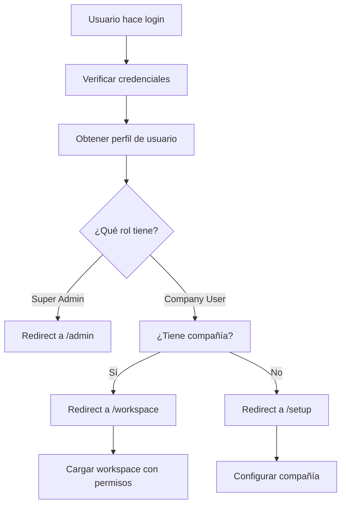

# Sistema de Usuarios Multi-Tenant - Guía de Configuración

## 🎯 Descripción General

Este sistema implementa un robusto sistema de autenticación y autorización multi-tenant con diferentes tipos de usuarios y permisos granulares.

## 👥 Tipos de Usuarios

### 1. **Super Admin** 🔑
- **Permisos**: Acceso completo a toda la plataforma
- **Puede**: Gestionar todas las compañías, todos los usuarios, configuración global
- **Accede a**: Panel de administración (`/admin`)

### 2. **Company Owner** 👑
- **Permisos**: Control total sobre su compañía
- **Puede**: Gestionar usuarios, configuración de compañía, facturación, todos los módulos
- **Accede a**: Workspace de su compañía (`/workspace`)

### 3. **Company Admin** ⚙️
- **Permisos**: Administración de la compañía (sin facturación)
- **Puede**: Gestionar usuarios, proyectos, clientes, configuración general
- **Accede a**: Workspace de su compañía (`/workspace`)

### 4. **Manager** 📊
- **Permisos**: Gestión operativa
- **Puede**: Gestionar proyectos, clientes, ver reportes
- **Accede a**: Workspace de su compañía (`/workspace`)

### 5. **Employee** 👤
- **Permisos**: Usuario estándar
- **Puede**: Trabajar con proyectos y clientes asignados
- **Accede a**: Workspace de su compañía (`/workspace`)

### 6. **Viewer** 👁️
- **Permisos**: Solo lectura
- **Puede**: Ver información y reportes (sin editar)
- **Accede a**: Workspace de su compañía (`/workspace`)

## 🚀 Configuración Inicial

### 1. Ejecutar Migraciones

```bash
# Aplicar la migración del sistema de usuarios
supabase db push
```

O ejecutar manualmente:
```sql
-- Ejecutar el archivo de migración
\i supabase/migrations/0008_update_user_system.sql
```

### 2. Crear Super Admin

Opción A - **Via SQL Script**:
```sql
-- Editar scripts/create-super-admin.sql con tu email y contraseña
\i scripts/create-super-admin.sql
```

Opción B - **Via Supabase Dashboard**:
1. Ir a Authentication > Users
2. Hacer clic en "Add user"
3. Ingresar email y contraseña
4. Ejecutar este SQL para asignar el rol:

```sql
UPDATE user_profiles 
SET 
  role = 'super_admin',
  full_name = 'Super Administrator',
  status = 'active'
WHERE email = 'tu-email@ejemplo.com';
```

### 3. Verificar Configuración

```sql
-- Verificar que el super admin fue creado
SELECT 
  up.email,
  up.full_name,
  up.role,
  up.status
FROM user_profiles up
WHERE up.role = 'super_admin';
```

## 🏢 Gestión de Compañías

### Crear Nueva Compañía

```sql
INSERT INTO companies (
  name,
  slug,
  plan,
  max_users,
  max_contacts,
  status
) VALUES (
  'Mi Empresa',
  'mi-empresa',
  'professional',
  20,
  5000,
  'active'
);
```

### Crear Company Owner

```sql
-- Primero crear el usuario en auth (via dashboard o API)
-- Luego crear el perfil:
INSERT INTO user_profiles (
  id,
  email,
  full_name,
  company_id,
  role,
  status
) VALUES (
  'user-uuid-from-auth',
  'owner@miempresa.com',
  'Propietario Empresa',
  'company-uuid',
  'company_owner',
  'active'
);
```

## 🔧 APIs Disponibles

### Autenticación
- `POST /api/auth/users` - Crear usuario
- `GET /api/auth/users` - Listar usuarios de compañía
- `PUT /api/auth/users` - Actualizar usuario
- `DELETE /api/auth/users` - Eliminar usuario

### Compañías
- `GET /api/auth/company` - Obtener información de compañía
- `PUT /api/auth/company` - Actualizar compañía

## 🛡️ Seguridad y Permisos

### Row Level Security (RLS)

El sistema implementa RLS automático que garantiza:

- ✅ **Aislamiento por compañía**: Los usuarios solo ven datos de su compañía
- ✅ **Permisos granulares**: Cada rol tiene permisos específicos
- ✅ **Protección de escalada**: Los usuarios no pueden elevarse permisos
- ✅ **Auditoría**: Todos los cambios quedan registrados

### Matriz de Permisos

| Permiso | Super Admin | Owner | Admin | Manager | Employee | Viewer |
|---------|-------------|-------|-------|---------|----------|--------|
| `read` | ✅ | ✅ | ✅ | ✅ | ✅ | ✅ |
| `write` | ✅ | ✅ | ✅ | ✅ | ✅ | ❌ |
| `delete` | ✅ | ✅ | ✅ | ❌ | ❌ | ❌ |
| `manage_users` | ✅ | ✅ | ✅ | ❌ | ❌ | ❌ |
| `manage_company` | ✅ | ✅ | ❌ | ❌ | ❌ | ❌ |
| `manage_projects` | ✅ | ✅ | ✅ | ✅ | ✅ | ❌ |
| `manage_clients` | ✅ | ✅ | ✅ | ✅ | ✅ | ❌ |
| `view_reports` | ✅ | ✅ | ✅ | ✅ | ❌ | ✅ |
| `manage_billing` | ✅ | ✅ | ❌ | ❌ | ❌ | ❌ |
| `admin_access` | ✅ | ✅ | ✅ | ❌ | ❌ | ❌ |
| `super_admin_access` | ✅ | ❌ | ❌ | ❌ | ❌ | ❌ |

## 🎨 Componentes UI

### UserManagement Component

```tsx
import UserManagement from '@/components/auth/UserManagement'

<UserManagement 
  companyId={currentUser.company_id}
  currentUser={currentUser}
/>
```

### Hooks de Autenticación

```tsx
import { getCurrentUserClient, hasPermission } from '@/lib/auth'

// Obtener usuario actual
const user = await getCurrentUserClient()

// Verificar permisos
const canManageUsers = hasPermission(user, 'manage_users')
```

## 🔄 Flujo de Autenticación



## 📱 Páginas del Sistema

### Para Super Admins
- `/admin` - Panel de administración global
- `/admin/companies` - Gestión de compañías
- `/admin/users` - Gestión global de usuarios

### Para Usuarios de Compañía
- `/workspace` - Dashboard principal
- `/workspace/team` - Gestión de equipo (si tiene permisos)
- `/workspace/construccion` - Módulo de construcción
- `/workspace/settings` - Configuración (si tiene permisos)

## 🐛 Troubleshooting

### Usuario no puede acceder después del login
1. Verificar que tiene un perfil en `user_profiles`
2. Verificar que está asignado a una compañía
3. Verificar que la compañía está activa

```sql
-- Verificar perfil de usuario
SELECT * FROM user_profiles WHERE email = 'usuario@ejemplo.com';

-- Verificar compañía
SELECT * FROM companies WHERE id = 'company-uuid';
```

### Permisos no funcionan correctamente
1. Verificar que las políticas RLS están activas
2. Verificar que el rol del usuario es correcto
3. Verificar que la compañía del usuario coincide

```sql
-- Verificar políticas RLS
SELECT schemaname, tablename, policyname, permissive, roles, cmd, qual 
FROM pg_policies 
WHERE tablename = 'user_profiles';
```

### Error al crear usuarios
1. Verificar que el email no existe
2. Verificar que la compañía existe
3. Verificar permisos del usuario que crea

## 📞 Soporte

Para problemas o preguntas sobre el sistema de usuarios:

1. Revisar los logs de Supabase
2. Verificar las políticas RLS
3. Consultar la documentación de permisos
4. Revisar el estado de la base de datos

## 🔄 Actualizaciones Futuras

### Funcionalidades Planeadas
- [ ] Invitaciones por email
- [ ] Reset de contraseña personalizado
- [ ] Autenticación de dos factores
- [ ] Logs de auditoría detallados
- [ ] API de webhooks para cambios de usuarios
- [ ] Integración con proveedores OAuth (Google, Microsoft)

### Mejoras de Seguridad
- [ ] Políticas de contraseña más estrictas
- [ ] Bloqueo de cuenta por intentos fallidos
- [ ] Notificaciones de login sospechoso
- [ ] Rotación automática de tokens 