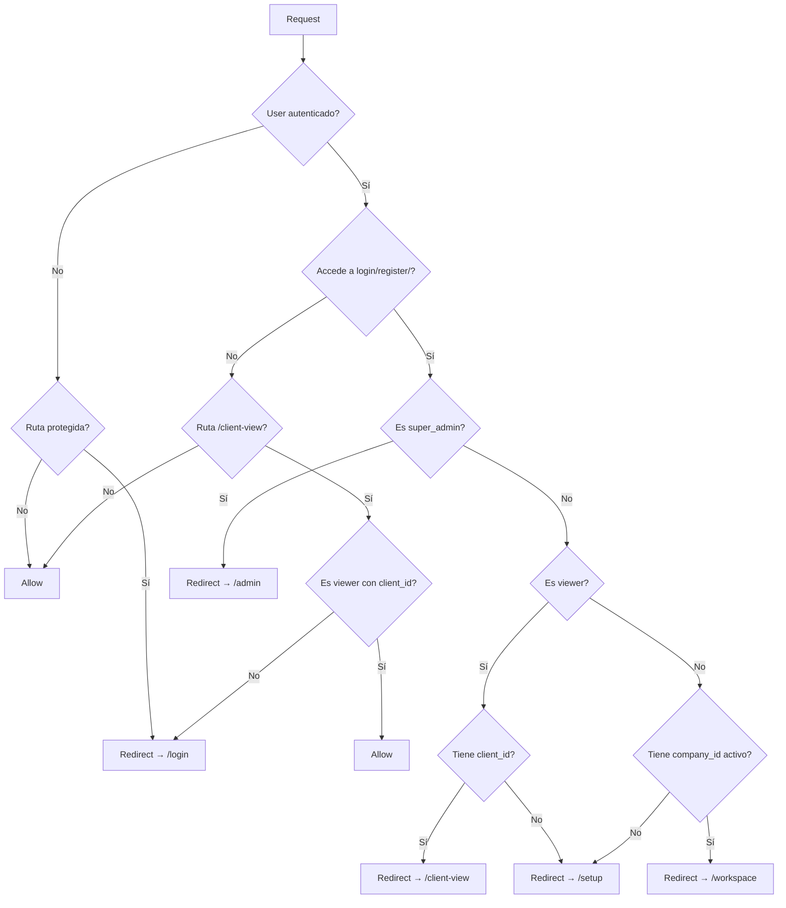
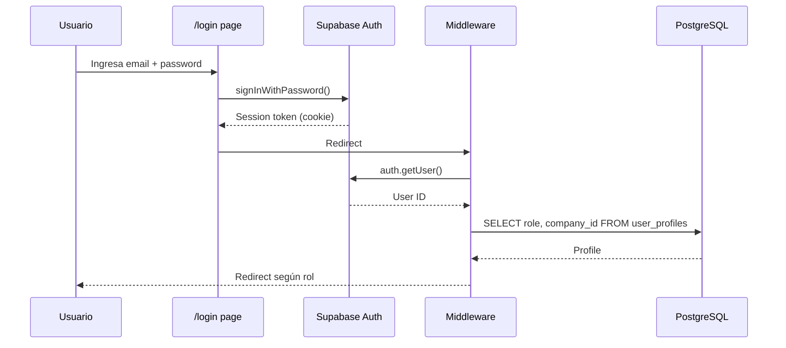

# Autenticación

> [Inicio](../README.md) > Arquitectura > Autenticación

## Proveedor de auth

FOMO usa **Supabase Auth** con autenticación por email/password y gestión de sesiones via cookies SSR.

## Separación client / server

La autenticación está dividida en tres archivos. **Nunca mezclar imports**.

| Archivo | Usar desde | Función principal |
|---------|-----------|-------------------|
| `lib/auth-client.ts` | Componentes `'use client'` | `getCurrentUserClient()` |
| `lib/auth-server.ts` | API routes, Server Components | `getCurrentUser()` |
| `lib/auth-types.ts` | Cualquier lugar | Tipos, constantes, helpers puros |

```typescript
// ✅ En un componente client
import { getCurrentUserClient } from '@/lib/auth-client'

// ✅ En una API route o Server Component
import { getCurrentUser } from '@/lib/auth-server'

// ❌ NUNCA en un componente client (causa error de build)
import { getCurrentUser } from '@/lib/auth-server'
```

**¿Por qué?** `auth-server.ts` importa `utils/supabase/server.ts` que usa `next/headers` (solo disponible en el servidor). Importarlo desde el client causa un error de build.

## Clientes Supabase

| Cliente | Archivo | Uso | RLS |
|---------|---------|-----|-----|
| Browser | `utils/supabase/client.ts` | Componentes client | Sí, respeta RLS |
| Server | `utils/supabase/server.ts` | API routes, Server Components | Sí, respeta RLS |
| Admin | `lib/supabaseAdmin.ts` | Operaciones con service_role | **No**, bypass RLS |

> **Regla**: `supabaseAdmin` solo se usa cuando se necesita bypass de RLS (ej: crear usuario, operaciones cross-tenant). Nunca exponerlo al client.

## Middleware de routing

El archivo `utils/supabase/middleware.ts` intercepta todas las requests y:

1. **Refresca la sesión** con `auth.getUser()` (mantiene el token vigente)
2. **Redirige según el rol** cuando el usuario accede a `/`, `/login`, `/register`:



3. **Valida acceso a /client-view**: solo viewers activos con `client_id`

## Flujo de login



## Funciones de auth disponibles

### Server-side (`lib/auth-server.ts`)

| Función | Descripción |
|---------|-------------|
| `getCurrentUser()` | Obtiene UserProfile completo con permisos |
| `getUserCompany(userId)` | Obtiene la Company del usuario |
| `isSuperAdmin(userId?)` | Verifica si es super admin |
| `userHasPermission(userId, permission)` | Verifica un permiso específico |
| `getCompanyUsers(companyId)` | Lista usuarios de una empresa |
| `createUser(data)` | Crea usuario (Auth + Profile) |
| `inviteUser(data)` | Invita usuario por email |
| `changeUserRole(userId, role)` | Cambia rol de usuario |

### Client-side (`lib/auth-client.ts`)

| Función | Descripción |
|---------|-------------|
| `getCurrentUserClient()` | Obtiene UserProfile (verifica super_admins primero) |
| `hasPermission(user, permission)` | Verifica permiso de un usuario |
| `isSuperAdmin(user)` | Verifica si es super admin |
| `isCompanyAdmin(user)` | Verifica si es admin de empresa |
| `getUserCompanyClient(userId)` | Obtiene Company desde el browser |
| `redirectToWorkspace(router)` | Redirige al workspace con company_id |
| `logout(router)` | Cierra sesión y redirige a /login |

### Hooks

| Hook | Archivo | Descripción |
|------|---------|-------------|
| `useWorkspace()` | `components/workspace-context.tsx` | Company, features, módulos, datos de usuario |
| `useIsSuperAdmin()` | `components/workspace-context.tsx` | Verifica super admin desde client |

## Archivos relevantes

- `lib/auth-client.ts` - Auth client-side
- `lib/auth-server.ts` - Auth server-side
- `lib/auth-types.ts` - Tipos y constantes compartidos
- `utils/supabase/middleware.ts` - Lógica de middleware
- `utils/supabase/client.ts` - Cliente browser
- `utils/supabase/server.ts` - Cliente server
- `lib/supabaseAdmin.ts` - Cliente admin (bypass RLS)
- `middleware.ts` - Entry point del middleware

## Ver también

- [Autorización](autorizacion.md) - Roles y permisos
- [Multi-tenancy](multi-tenancy.md) - Aislamiento por company_id
- [Seguridad](seguridad.md) - Prácticas de seguridad
