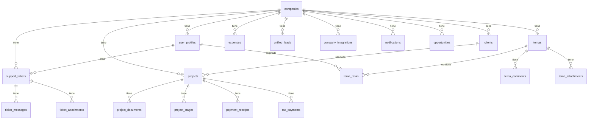

# Base de Datos

> [Inicio](../README.md) > Arquitectura > Base de Datos

## Motor y hosting

- **Motor**: PostgreSQL 17
- **Hosting**: Supabase Cloud
- **ORM**: No se usa ORM. Queries directas via Supabase client (`supabase.from('tabla').select(...)`)
- **Tipos**: Auto-generados con `npm run gen:types` → `lib/database.types.ts`

> **ALERTA**: La base de datos conectada en desarrollo es de **producción**. Los datos de clientes activos (INTED) son reales. Nunca ejecutar operaciones destructivas.

## Tablas por módulo

### Core de la plataforma

| Tabla | Propósito |
|-------|-----------|
| `companies` | Empresas/tenants. Incluye `features[]`, `plan`, `settings` |
| `user_profiles` | Usuarios. Incluye `role`, `company_id`, `status` |
| `super_admins` | Super administradores (tabla separada de `user_profiles`) |
| `modules` | Catálogo de módulos de la plataforma |
| `template_modules` | Plantillas de módulos por tipo de empresa |
| `client_templates` | Templates específicos por cliente |
| `company_role_modules` | Módulos visibles por rol dentro de una empresa |
| `user_module_overrides` | Overrides de módulos por usuario específico |
| `company_integrations` | Credenciales cifradas de integraciones |
| `company_integrations_audit` | Auditoría de cambios en integraciones |
| `company_invitations` | Invitaciones pendientes a usuarios |
| `pending_company_users` | Usuarios pendientes de registro |
| `registration_requests` | Solicitudes de registro de empresas |
| `notifications` | Notificaciones de usuarios |

### Construcción

| Tabla | Propósito |
|-------|-----------|
| `projects` | Proyectos de construcción |
| `clients` | Clientes de las empresas |
| `project_documents` | Documentos adjuntos a proyectos |
| `project_expiration_dates` | Vencimientos de documentos |
| `project_upload_dates` | Fechas de subida |
| `document_relationships` | Relaciones entre documentos |
| `payment_receipts` | Comprobantes de pago |
| `project_stages` | Etapas de obra |
| `project_stage_completions` | Progreso de etapas |
| `tax_payments` | Pagos de impuestos |
| `professional_commissions` | Honorarios profesionales |
| `professional_councils` | Datos de colegios profesionales |
| `construction_deadline_rules` | Reglas de cálculo de plazos |
| `construction_rights` | Derechos de propiedad |
| `surplus_value_rights` | Plusvalía |
| `surplus_value_zones` | Zonas de plusvalía |
| `project_expedientes` | Expedientes legales |
| `project_sections` | Secciones/subdivisiones |
| `project_status_history` | Historial de cambios de estado |

### CRM y Leads

| Tabla | Propósito |
|-------|-----------|
| `unified_leads` | Leads unificados multi-canal |
| `contact_leads` | Leads de contactos individuales |
| `pyme_leads` | Leads de PyMEs |
| `crm_contacts` | Contactos de personas dentro de clientes |
| `lead_activities` | Actividades sobre leads |
| `lead_scoring_rules` | Reglas de scoring automático |
| `channel_processors` | Procesadores por canal |
| `chatbot_analytics` | Datos de chatbot |
| `chatbot_contacts` | Contactos de chatbot |

### Temas / Expedientes

| Tabla | Propósito |
|-------|-----------|
| `temas` | Temas/expedientes principales |
| `tema_types` | Tipos de tema |
| `tema_areas` | Áreas de práctica |
| `tema_tasks` | Tareas dentro de temas |
| `tema_task_templates` | Templates reutilizables de tareas |
| `tema_assignees` | Asignaciones de equipo |
| `tema_comments` | Comentarios/notas |
| `tema_attachments` | Archivos adjuntos |
| `tema_activity` | Log de actividad |

### Finanzas

| Tabla | Propósito |
|-------|-----------|
| `expenses` | Registros de gastos |
| `categories` | Categorías de gastos |
| `imported_files` | Tracking de archivos importados |

### Soporte

| Tabla | Propósito |
|-------|-----------|
| `support_tickets` | Tickets de soporte |
| `ticket_messages` | Mensajes/respuestas |
| `ticket_attachments` | Archivos adjuntos |
| `ticket_categories` | Categorías de tickets |

### Otros

| Tabla | Propósito |
|-------|-----------|
| `opportunities` | Oportunidades de venta |
| `hubspot_action_plans` | Planes de acción generados por IA |

## Diagrama de relaciones principales



## Convenciones

### Naming
- Tablas: `snake_case` plural (ej: `project_documents`)
- Columnas: `snake_case` (ej: `company_id`, `created_at`)
- Índices: `idx_tabla_columna` (ej: `idx_projects_company_id`)

### Columnas estándar
Toda tabla debería tener:
- `id UUID DEFAULT gen_random_uuid() PRIMARY KEY`
- `company_id UUID NOT NULL REFERENCES companies(id)` (excepto tablas globales)
- `created_at TIMESTAMPTZ DEFAULT NOW()`
- `updated_at TIMESTAMPTZ DEFAULT NOW()`

### Migraciones
- Ubicación: `supabase/migrations/`
- Formato: `NNNN_descripcion.sql` (ej: `0035_create_nueva_tabla.sql`)
- Número secuencial incremental
- Solo migraciones **aditivas** en producción

Ver [Trabajar con Base de Datos](../guias/trabajar-con-base-datos.md) para el proceso completo.

## Regenerar tipos TypeScript

Después de cualquier cambio en el schema:

```bash
npm run gen:types
```

Esto actualiza `lib/database.types.ts` con los tipos generados por Supabase.

## Archivos relevantes

- `lib/database.types.ts` - Tipos auto-generados
- `supabase/migrations/` - 54+ migraciones SQL
- `supabase/config.toml` - Configuración local de Supabase

## Ver también

- [Multi-tenancy](multi-tenancy.md) - RLS y aislamiento
- [Trabajar con Base de Datos](../guias/trabajar-con-base-datos.md) - Guía práctica
- [Seguridad](seguridad.md) - Cifrado de credenciales
