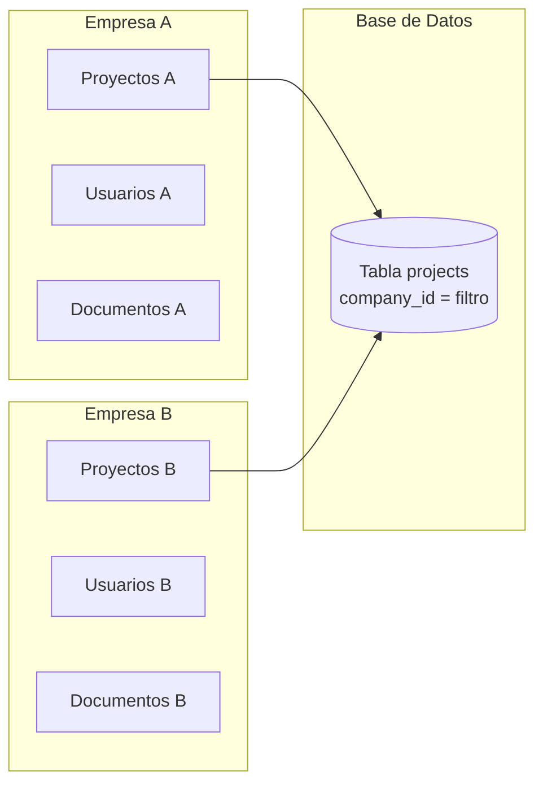

# Multi-tenancy

> [Inicio](../README.md) > Arquitectura > Multi-tenancy

## Modelo de aislamiento

Cada empresa (tenant) tiene un `company_id` UUID. Toda tabla que contiene datos de empresa incluye una columna `company_id UUID REFERENCES companies(id)`.



**El aislamiento se aplica en dos niveles:**

1. **Código (API routes)**: toda query filtra por `company_id` del usuario autenticado
2. **Base de datos (RLS)**: PostgreSQL bloquea acceso a filas de otras empresas

## RLS - Patrón de 3 capas

Toda tabla sensible usa este patrón de policies:

```sql
-- Capa 1: Super admin - acceso total
CREATE POLICY "Super admins full access" ON tabla
  FOR ALL USING (is_super_admin())
  WITH CHECK (is_super_admin());

-- Capa 2: Admin de empresa - CRUD en su empresa
CREATE POLICY "Company admins manage" ON tabla
  FOR ALL
  USING (company_id = get_user_company_id() AND is_company_admin())
  WITH CHECK (company_id = get_user_company_id() AND is_company_admin());

-- Capa 3: Usuarios - lectura de su empresa
CREATE POLICY "Users read own company" ON tabla
  FOR SELECT
  USING (
    is_super_admin()
    OR (auth.uid() IS NOT NULL AND company_id = get_user_company_id())
  );
```

## Funciones SQL helper

Definidas como `SECURITY DEFINER` (se ejecutan con los privilegios del creador, no del usuario):

| Función | Retorna | Descripción |
|---------|---------|-------------|
| `is_super_admin()` | `boolean` | Verifica si el usuario actual es super admin |
| `is_company_admin()` | `boolean` | Verifica si es admin de su empresa |
| `get_user_company_id()` | `UUID` | Retorna el company_id del usuario actual |
| `get_user_role()` | `text` | Retorna el rol del usuario actual |

Estas funciones consultan `user_profiles` y `super_admins` internamente.

## Filtrado en API routes

El patrón estándar en toda API route:

```typescript
export async function GET(request: NextRequest) {
  const supabase = await createClient()
  const { data: { user } } = await supabase.auth.getUser()
  if (!user) return NextResponse.json({ error: 'No autorizado' }, { status: 401 })

  const { data: profile } = await supabase
    .from('user_profiles')
    .select('company_id, role')
    .eq('id', user.id)
    .single()

  // Super admin puede acceder a cualquier empresa
  const companyId = profile.role === 'super_admin'
    ? searchParams.get('company_id') || profile.company_id
    : profile.company_id  // Usuarios regulares: SIEMPRE su empresa

  const { data } = await supabase
    .from('projects')
    .select('*')
    .eq('company_id', companyId)

  return NextResponse.json(data)
}
```

**Regla crítica**: nunca confiar en `company_id` de query params para usuarios regulares. Solo super_admin puede especificarlo.

## Crear una tabla nueva con aislamiento

Checklist para toda tabla nueva:

```sql
-- 1. Crear tabla con company_id
CREATE TABLE IF NOT EXISTS nueva_tabla (
  id UUID DEFAULT gen_random_uuid() PRIMARY KEY,
  company_id UUID NOT NULL REFERENCES companies(id),
  -- ... otros campos
  created_at TIMESTAMPTZ DEFAULT NOW(),
  updated_at TIMESTAMPTZ DEFAULT NOW()
);

-- 2. Habilitar RLS
ALTER TABLE nueva_tabla ENABLE ROW LEVEL SECURITY;

-- 3. Aplicar patrón de 3 capas
CREATE POLICY "Super admins full access" ON nueva_tabla
  FOR ALL USING (is_super_admin())
  WITH CHECK (is_super_admin());

CREATE POLICY "Company admins manage" ON nueva_tabla
  FOR ALL
  USING (company_id = get_user_company_id() AND is_company_admin())
  WITH CHECK (company_id = get_user_company_id() AND is_company_admin());

CREATE POLICY "Users read own company" ON nueva_tabla
  FOR SELECT
  USING (is_super_admin() OR (auth.uid() IS NOT NULL AND company_id = get_user_company_id()));

-- 4. Crear índice en company_id
CREATE INDEX idx_nueva_tabla_company_id ON nueva_tabla(company_id);
```

## Archivos relevantes

- `lib/auth-types.ts` - Tipos de roles y funciones de permisos
- `lib/auth-server.ts` - `getCurrentUser()` para obtener company_id en el servidor
- `supabase/migrations/` - Migraciones con RLS policies

## Ver también

- [Autenticación](autenticacion.md) - Cómo se identifica al usuario
- [Autorización](autorizacion.md) - Qué puede hacer cada rol
- [Base de Datos](base-de-datos.md) - Schema y convenciones
- [Trabajar con Base de Datos](../guias/trabajar-con-base-datos.md) - Guía práctica
