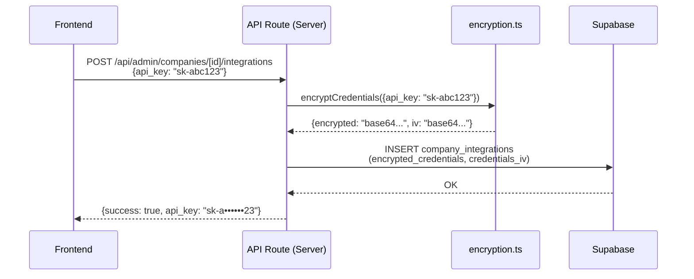
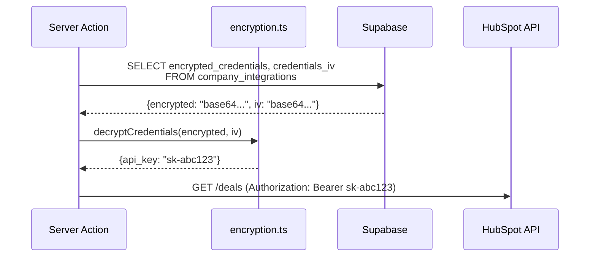

# Seguridad

> [Inicio](../README.md) > Arquitectura > Seguridad

## Capas de seguridad

```
┌───────────────────────────────────────┐
│ 1. Middleware (auth + routing)        │  Sesión válida, redirect por rol
├───────────────────────────────────────┤
│ 2. API Routes (auth + company_id)    │  Verificación de usuario y permisos
├───────────────────────────────────────┤
│ 3. RLS Policies (PostgreSQL)         │  Filtrado automático de filas
├───────────────────────────────────────┤
│ 4. Cifrado (AES-256-GCM)            │  Credenciales de integraciones
└───────────────────────────────────────┘
```

## Cifrado de credenciales (AES-256-GCM)

Las API keys de integraciones (HubSpot, OpenAI, etc.) se almacenan cifradas en `company_integrations`.

### Algoritmo
- **Cifrado**: AES-256-GCM (autenticado)
- **IV**: 12 bytes random por operación
- **Auth tag**: 16 bytes
- **Clave**: 32 bytes (64 chars hex) en `ENCRYPTION_KEY`

### Flujo de cifrado



### Flujo de descifrado



### Funciones disponibles

| Función | Descripción |
|---------|-------------|
| `encryptSecret(plaintext)` | Cifra un string |
| `decryptSecret(encrypted, iv)` | Descifra un string |
| `encryptCredentials(obj)` | Cifra un objeto JSON |
| `decryptCredentials(encrypted, iv)` | Descifra a objeto JSON |
| `maskSecret(secret, visibleChars)` | Enmascara para display (ej: `sk-a••••••23`) |

### Providers soportados

```typescript
const PROVIDER_SCHEMAS = {
  openai:    { fields: ['api_key'], optional: ['organization_id'] },
  gemini:    { fields: ['api_key'] },
  anthropic: { fields: ['api_key'] },
  hubspot:   { fields: ['api_key'], optional: ['portal_id'] },
  custom:    { fields: ['api_key'], optional: ['base_url', 'extra_headers'] }
}
```

## Reglas de seguridad críticas

### NUNCA

- Exponer `SUPABASE_SERVICE_ROLE_KEY` o `ENCRYPTION_KEY` al client
- Importar `lib/auth-server` desde un componente `'use client'`
- Importar `lib/supabaseAdmin` desde el client
- Crear tablas sin RLS policies cuando contengan datos de empresa
- Confiar en `company_id` de query params para usuarios regulares
- Almacenar credenciales de integración en texto plano
- Enviar credenciales descifradas en respuestas de API al frontend
- Saltear validación de autenticación en API routes

### SIEMPRE

- Validar autenticación y permisos en cada API route
- Filtrar por `company_id` en queries de datos multi-tenant
- Usar el patrón de 3 capas de RLS en tablas nuevas
- Cifrar con `encryptCredentials()` antes de guardar en `company_integrations`
- Descifrar solo server-side con `decryptCredentials()`
- Sanitizar nombres de archivo antes de subir a storage
- Manejar errores con try/catch en API routes

## Variables de entorno sensibles

| Variable | Acceso | Propósito |
|----------|--------|-----------|
| `NEXT_PUBLIC_SUPABASE_URL` | Público | URL del proyecto Supabase |
| `NEXT_PUBLIC_SUPABASE_ANON_KEY` | Público | Clave anónima (respeta RLS) |
| `SUPABASE_SERVICE_ROLE_KEY` | **Solo server** | Bypass de RLS |
| `ENCRYPTION_KEY` | **Solo server** | Clave de cifrado AES-256 |

Las variables con prefijo `NEXT_PUBLIC_` son accesibles desde el browser. Las demás son solo server-side por diseño de Next.js.

## Auditoría

Los cambios en credenciales de integración se registran en `company_integrations_audit`:
- Quién hizo el cambio
- Qué tipo de operación (crear, actualizar, eliminar)
- Timestamp

## Archivos relevantes

- `lib/encryption.ts` - Funciones de cifrado/descifrado
- `lib/auth-server.ts` - Auth server-side
- `lib/auth-client.ts` - Auth client-side
- `lib/supabaseAdmin.ts` - Cliente admin (bypass RLS)
- `utils/supabase/middleware.ts` - Middleware de auth

## Ver también

- [Multi-tenancy](multi-tenancy.md) - RLS de 3 capas
- [Autenticación](autenticacion.md) - Sistema de auth
- [Variables de Entorno](../referencias/variables-entorno.md) - Listado completo
