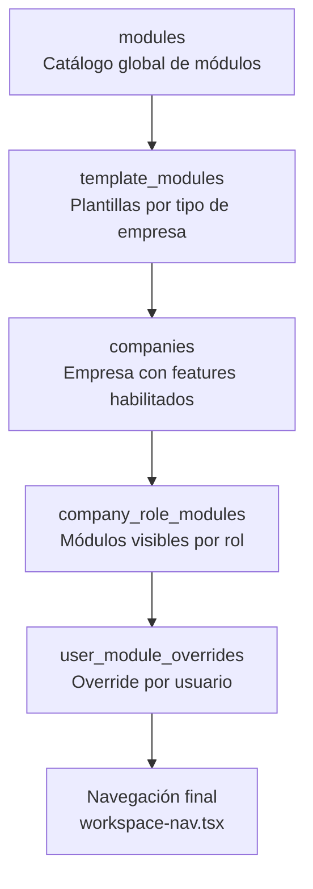
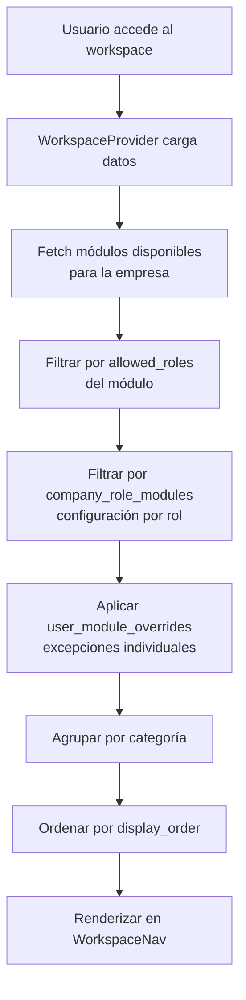

# Sistema Modular

> [Inicio](../README.md) > Arquitectura > Sistema Modular

## Cómo funcionan los módulos dinámicos

FOMO muestra diferentes módulos en la navegación según la empresa, el rol del usuario, y configuraciones individuales. No todas las empresas ven los mismos módulos.

## Entidades involucradas



| Tabla | Propósito |
|-------|-----------|
| `modules` | Catálogo global de todos los módulos disponibles |
| `template_modules` | Qué módulos incluye cada template de empresa |
| `companies.features[]` | Array de features habilitados para la empresa |
| `company_role_modules` | Qué módulos ve cada rol dentro de una empresa |
| `user_module_overrides` | Excepciones por usuario individual |

## Estructura de un módulo

Cada registro en `modules` tiene:

```typescript
{
  id: string,
  name: string,              // Nombre visible (ej: "Construcción")
  slug: string,              // Identificador (ej: "construccion")
  route_path: string,        // Ruta (ej: "/workspace/construccion")
  icon: string,              // Nombre del ícono de lucide-react (ej: "Building2")
  category: string,          // Categoría (Dashboard, CRM, Workspace, Tools, Admin)
  display_order: number,     // Orden dentro de la categoría
  allowed_roles: string[],   // Roles que pueden ver el módulo (vacío = todos)
  requires_integration: string | null,  // Integración requerida (ej: "hubspot")
  is_active: boolean
}
```

## Flujo de resolución de módulos visibles



## Navegación dinámica (`workspace-nav.tsx`)

El componente `WorkspaceNav` consume `availableModules` del `WorkspaceContext` y:

1. **Filtra por `allowed_roles`**: si el módulo tiene roles definidos, verifica que el usuario tenga uno de ellos
2. **Filtra por `requires_integration`**: verifica que la integración esté activa (TODO: pendiente)
3. **Agrupa por categoría**: Dashboard, Analytics, CRM, Workspace, Tools, Admin
4. **Ordena**: categorías por prioridad fija, módulos por `display_order`
5. **Renderiza**: links con íconos de lucide-react, estado activo basado en pathname

### Orden de categorías

```typescript
const orderMap = {
  'Dashboard': 1,
  'Analytics': 2,
  'CRM': 3,
  'Workspace': 4,
  'Tools': 5,
  'Admin': 6
}
```

### Mapping de íconos

Los íconos se resuelven por nombre string desde un mapa de lucide-react:

```typescript
const ICONS = {
  LayoutDashboard, Users, TrendingUp, Building2, BookOpen,
  Receipt, Settings, HandCoins, Target, BarChart3, ...
}
```

Si el ícono no existe en el mapa, se usa `LayoutDashboard` como fallback.

## Agregar un módulo nuevo

1. Crear las rutas del módulo en `app/(workspace)/workspace/nuevo-modulo/`
2. Crear las API routes en `app/api/workspace/nuevo-modulo/`
3. Insertar el registro en la tabla `modules` (via migración o admin panel)
4. Configurar `allowed_roles` si es necesario
5. Si usa ícono nuevo, agregarlo al mapa en `workspace-nav.tsx`

Ver [Crear un Módulo Nuevo](../guias/crear-modulo-nuevo.md) para el paso a paso completo.

## Gestión desde el Admin Panel

El super admin puede gestionar módulos desde:

- **`/admin/modules`**: Activar/desactivar módulos globalmente
- **`/admin/templates`**: Configurar qué módulos incluye cada template
- **`/admin/companies/[id]`**: Configurar módulos por empresa
- **`/workspace/settings/users`**: Configurar módulos por rol y por usuario (admin de empresa)

## Archivos relevantes

- `components/workspace-nav.tsx` - Navegación dinámica
- `components/workspace-context.tsx` - Provider con `availableModules`
- `app/(workspace)/workspace/layout.tsx` - Layout que carga módulos
- `app/api/workspace/settings/role-modules/route.ts` - API de módulos por rol
- `app/api/workspace/settings/user-modules/route.ts` - API de overrides por usuario

## Ver también

- [Autorización](autorizacion.md) - Roles y permisos
- [Crear un Módulo Nuevo](../guias/crear-modulo-nuevo.md) - Guía práctica
- [Módulos y Templates (Admin)](../modulos/admin/modulos-y-templates.md) - Gestión desde admin
