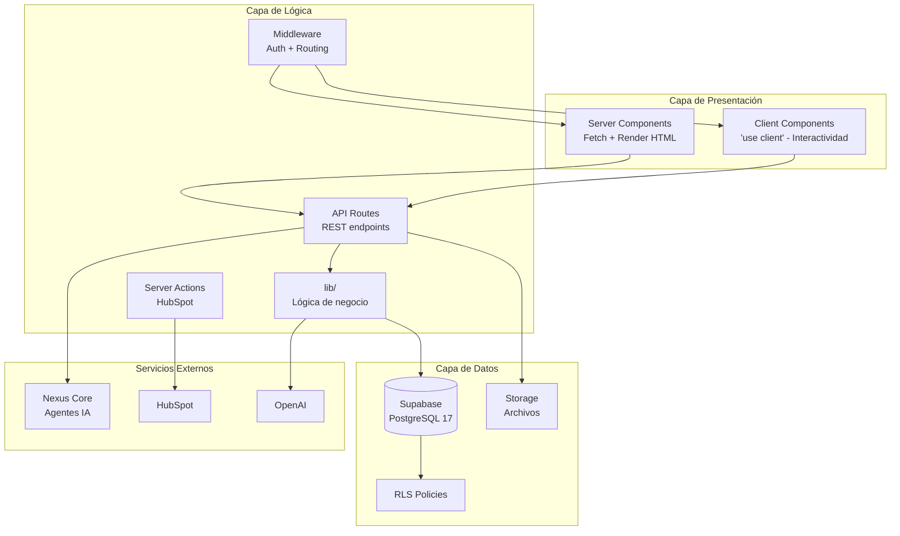
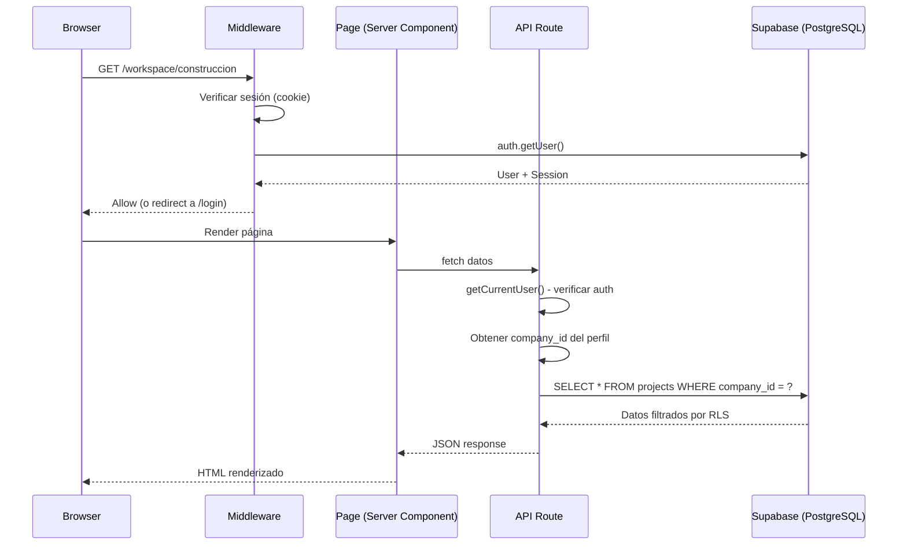

# Arquitectura - Visión General

> [Inicio](../README.md) > Arquitectura > Visión General

## Capas de la aplicación



## Flujo de una request típica



## Rutas principales de la aplicación

| Ruta | Propósito | Acceso |
|------|-----------|--------|
| `/login` | Login de usuarios | Público |
| `/client-login` | Login de viewers | Público |
| `/register` | Registro de empresas | Público |
| `/setup` | Setup inicial de perfil | Autenticado sin perfil |
| `/workspace/*` | Módulos del workspace | Usuarios con company_id |
| `/admin/*` | Panel de super admin | Solo super_admin |
| `/client-view/*` | Portal de cliente | Solo viewer con client_id |
| `/api/*` | API REST | Depende del endpoint |

## Archivos clave de infraestructura

| Archivo | Propósito |
|---------|-----------|
| `middleware.ts` | Entry point del middleware (delega a `utils/supabase/middleware.ts`) |
| `utils/supabase/middleware.ts` | Lógica de auth, refresh de sesión, routing por rol |
| `utils/supabase/client.ts` | Cliente Supabase para el browser |
| `utils/supabase/server.ts` | Cliente Supabase para el servidor (cookies) |
| `lib/supabaseAdmin.ts` | Cliente admin (bypass RLS, solo server) |
| `app/layout.tsx` | Layout raíz (ThemeProvider, fonts, Toaster) |
| `app/(workspace)/workspace/layout.tsx` | Layout del workspace (sidebar, header, context) |
| `app/admin/layout.tsx` | Layout del admin panel |

## Patrones arquitectónicos

### Page Wrapper Pattern
Las páginas usan el patrón de Server Component wrapper + Client Component:

```
page.tsx          → Server Component: fetch de datos
client-page.tsx   → Client Component: UI interactiva
```

El server component obtiene los datos y los pasa como props al client component. Esto permite:
- Fetch de datos en el servidor (más rápido, seguro)
- Interactividad en el cliente (useState, onClick, etc.)

### API Route Pattern
Toda API route sigue un patrón estándar:
1. Autenticar usuario
2. Obtener company_id del perfil
3. Filtrar queries por company_id
4. Retornar datos o error

Ver [Patrones de Código](../guias/patrones-codigo.md) para ejemplos.

## Ver también

- [Multi-tenancy](multi-tenancy.md) - Aislamiento de datos
- [Autenticación](autenticacion.md) - Sistema de auth
- [Patrones de Código](../guias/patrones-codigo.md) - Convenciones de código
