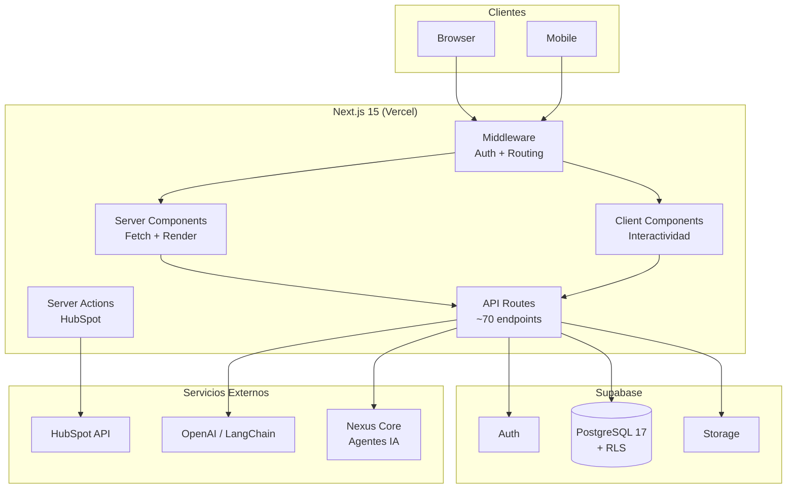

# Visión General

> [Inicio](../README.md) > Introducción > Visión General

## Qué es FOMO Platform

FOMO Platform es una plataforma empresarial B2B SaaS **multi-tenant**. Cada tenant es una empresa cliente que accede a un workspace centralizado donde gestiona su operación, clientes y herramientas.

La plataforma ofrece módulos configurables por empresa: construcción, CRM, finanzas, soporte, cotizaciones, y más. Cada empresa solo ve y usa los módulos que tiene habilitados.

## Jerarquía de acceso

```
┌─────────────────────────────────────────────────────────┐
│  SUPER ADMIN (equipo FOMO)                              │
│  Administra toda la plataforma, empresas y módulos      │
│                                                         │
│  ┌───────────────────────────────────────────────────┐  │
│  │  EMPRESA (tenant)                                 │  │
│  │  Workspace aislado con módulos habilitados        │  │
│  │                                                   │  │
│  │  ┌─────────────────────────────────────────────┐  │  │
│  │  │  USUARIOS DE EMPRESA                        │  │  │
│  │  │  owner > admin > manager > employee         │  │  │
│  │  └─────────────────────────────────────────────┘  │  │
│  │                                                   │  │
│  │  ┌─────────────────────────────────────────────┐  │  │
│  │  │  VIEWER (cliente final)                     │  │  │
│  │  │  Solo lectura + tickets de soporte propios  │  │  │
│  │  └─────────────────────────────────────────────┘  │  │
│  └───────────────────────────────────────────────────┘  │
└─────────────────────────────────────────────────────────┘
```

## Stack tecnológico

| Capa | Tecnología |
|------|-----------|
| Framework | Next.js 15 (App Router, Turbopack) |
| UI | React 19, TypeScript strict |
| Estilos | Tailwind CSS v4, CSS variables |
| Componentes | shadcn/ui (estilo New York), Radix UI |
| Iconos | lucide-react |
| Base de datos | Supabase (PostgreSQL 17) con RLS |
| Auth | Supabase Auth (cookies SSR) |
| Storage | Supabase Storage + Vercel Blob |
| Charts | Recharts |
| Notificaciones | sonner (toast) |
| Temas | next-themes (claro/oscuro) |
| Testing | Vitest + Testing Library + jsdom |
| Integraciones | HubSpot API, LangChain, OpenAI |
| Cifrado | AES-256-GCM (credenciales de integración) |
| Deploy | Vercel |

## Diagrama de alto nivel



## Entornos

| Entorno | URL | Base de datos |
|---------|-----|---------------|
| Producción | Vercel (deploy automático desde `main`) | Supabase Cloud |
| Desarrollo | `localhost:3000` | **Misma base de datos de producción** |

> **ALERTA**: No existe staging separado. La base de datos conectada en desarrollo es la misma de producción. Los datos de clientes activos (como INTED) son reales e intocables.

## Módulos disponibles

La plataforma tiene 13 módulos de workspace, un panel de administración completo, un portal de cliente, y Nexus AI para gestión de agentes autónomos.

Ver el [Índice de Módulos](../modulos/README.md) para el detalle de cada uno.

## Ver también

- [Conceptos Clave](conceptos-clave.md) - Multi-tenancy, RLS, roles
- [Primeros Pasos](primeros-pasos.md) - Setup del entorno de desarrollo
- [Arquitectura](../arquitectura/vision-general.md) - Cómo está construido internamente
