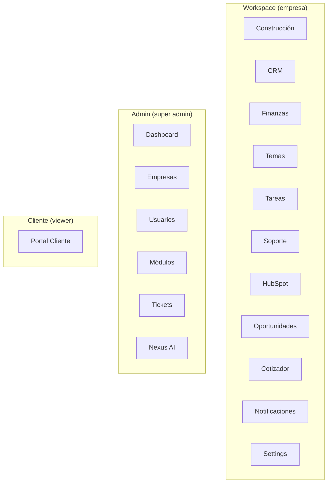

# Índice de Módulos

> [Inicio](../README.md) > Módulos

## Resumen

FOMO Platform tiene **13 módulos de workspace**, **11 funcionalidades de admin**, y un **portal de cliente**.

## Módulos del Workspace

Módulos disponibles para usuarios de empresa (según configuración y rol).

| Módulo | Ruta | Descripción | Doc |
|--------|------|-------------|-----|
| Construcción | `/workspace/construccion` | Proyectos de obra, documentos, plazos, etapas, impuestos | [Ver](workspace/construccion.md) |
| CRM | `/workspace/crm` + `/workspace/crm-fomo` | Clientes B2B, leads multi-canal, pipeline, scoring | [Ver](workspace/crm.md) |
| Finanzas | `/workspace/finanzas` | Gastos, categorías, importación CSV, charts | [Ver](workspace/finanzas.md) |
| Temas | `/workspace/temas` | Expedientes/temas con tareas, comentarios, adjuntos | [Ver](workspace/temas.md) |
| Tareas | `/workspace/tareas` | Tareas asignadas al usuario (cross-temas) | [Ver](workspace/tareas.md) |
| Soporte | `/workspace/soporte` | Tickets de soporte multi-rol | [Ver](workspace/soporte.md) |
| HubSpot | `/workspace/hubspot` | Analytics de ventas, precios, planes de acción IA | [Ver](workspace/hubspot.md) |
| Oportunidades | `/workspace/oportunidades` | Pipeline de ventas Kanban | [Ver](workspace/oportunidades.md) |
| Cotizador | `/workspace/cotizador` | Generador de cotizaciones | [Ver](workspace/cotizador.md) |
| Notificaciones | `/workspace/notifications` | Centro de notificaciones | [Ver](workspace/notificaciones.md) |
| Settings | `/workspace/settings` | Configuración del workspace, usuarios, empresa | [Ver](workspace/settings.md) |

## Panel de Administración

Funcionalidades disponibles solo para super admins.

| Módulo | Ruta | Descripción | Doc |
|--------|------|-------------|-----|
| Dashboard | `/admin` | Métricas de la plataforma, lista de empresas | [Ver](admin/dashboard.md) |
| Empresas | `/admin/companies` | Gestión de tenants, branding, integraciones | [Ver](admin/empresas.md) |
| Usuarios | `/admin/users` | Gestión de usuarios de toda la plataforma | [Ver](admin/usuarios.md) |
| Módulos y Templates | `/admin/modules` + `/admin/templates` | Catálogo de módulos, plantillas por tipo | [Ver](admin/modulos-y-templates.md) |
| Tickets | `/admin/tickets` | Gestión global de tickets, notas internas | [Ver](admin/tickets.md) |
| Nexus AI | `/admin/nexus` | Agentes autónomos, proyectos, aprobaciones | [Ver doc dedicada](../nexus-ai/vision-general.md) |
| Analytics | `/admin/analytics` | Analytics globales de la plataforma |  |
| API Keys | `/admin/api-keys` | Gestión de API keys |  |
| Settings | `/admin/settings` | Configuración global |  |

## Portal de Cliente

| Módulo | Ruta | Descripción | Doc |
|--------|------|-------------|-----|
| Portal de Cliente | `/client-view` | Dashboard y tickets para viewers | [Ver](client-view/portal-cliente.md) |

## Diagrama de módulos

