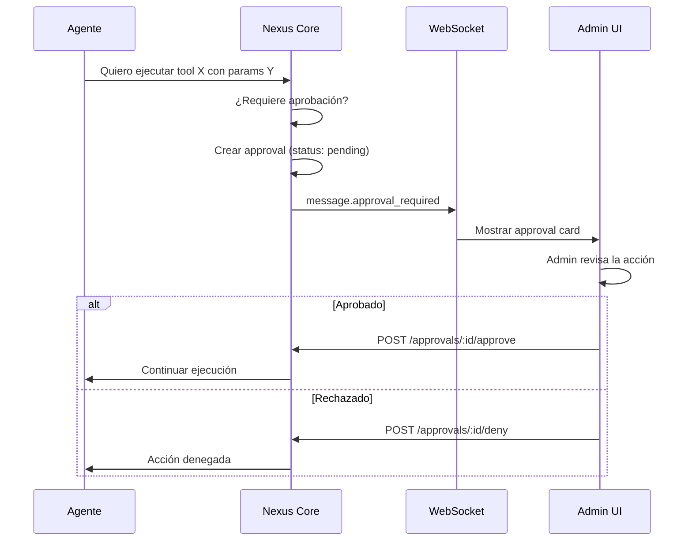

# Nexus AI - Aprobaciones

> [Inicio](../README.md) > [Nexus AI](vision-general.md) > Aprobaciones

## Human-in-the-loop

El sistema de aprobaciones permite que un agente solicite autorización humana antes de ejecutar acciones críticas. Esto es esencial para mantener control sobre agentes autónomos.

## Flujo



## Estructura

```typescript
interface NexusApproval {
  id: string
  projectId: string
  agentId: string
  sessionId: string
  toolId: string           // Herramienta que quiere usar
  action: unknown          // Parámetros de la acción
  status: 'pending' | 'approved' | 'denied'
  decidedBy: string | null // ID del admin que decidió
  decidedAt: string | null
  createdAt: string
}
```

## Dónde aparecen

Las aprobaciones pendientes se muestran en **3 lugares**:

### 1. Dashboard de Nexus (`/admin/nexus`)

- Stat card con contador de aprobaciones pendientes
- Preview de las 5 más recientes con botones inline de aprobar/rechazar
- Al aprobar/rechazar, el contador se actualiza inmediatamente

### 2. Cola de aprobaciones (`/admin/nexus/approvals`)

**Archivo:** `app/admin/nexus/approvals/page.tsx`

Página dedicada que lista todas las aprobaciones pendientes:

- Cards con borde amarillo izquierdo (`border-l-yellow-500`)
- Cada card muestra:
  - `toolId` en formato monospace
  - `projectId` truncado como badge
  - Timestamp de la solicitud
  - Preview JSON de los parámetros de la acción
- Botones: Aprobar (verde) / Rechazar (rojo)
- Estado vacío cuando no hay pendientes

### 3. Chat en tiempo real (inline)

Cuando el agente solicita aprobación durante una conversación en `/admin/nexus/projects/[id]/agents/[id]/chat`:

- Se recibe el evento WebSocket `message.approval_required`
- Se renderiza un `ChatApprovalCard` inline en el flujo del chat
- El admin puede aprobar/rechazar sin salir del chat
- El agente continúa o se detiene según la decisión

## Componente de UI

**Archivo:** `components/nexus/chat-approval-card.tsx`

```typescript
interface ChatApprovalCardProps {
  approvalId: string
  tool: string
  action: unknown
  onApprove: (id: string) => void
  onDeny: (id: string) => void
}
```

Renderiza una card con:
- Borde amarillo (warning) con fondo tintado
- Ícono `ShieldAlert` con texto "Approval Required"
- Badge con nombre de la herramienta
- Preview JSON formateado de la acción propuesta en `<pre>`
- Botones: Aprobar (verde) / Rechazar (rojo)

## Evento WebSocket

Cuando un agente solicita aprobación, se emite:

```json
{
  "type": "message.approval_required",
  "approvalId": "uuid",
  "tool": "send_email",
  "action": {
    "to": "cliente@example.com",
    "subject": "Propuesta comercial",
    "body": "..."
  }
}
```

Este evento es manejado en el chat (`chat/page.tsx`) que:
1. Crea una entrada en el historial de mensajes con tipo "approval"
2. Renderiza el `ChatApprovalCard` con callbacks
3. Al aprobar/rechazar, llama a `nexusApi.approveAction(id)` o `nexusApi.denyAction(id)`
4. Muestra toast de confirmación

## API

| Método | Endpoint | Descripción |
|--------|----------|-------------|
| GET | `/api/v1/approvals?status=pending` | Listar aprobaciones (filtrable por status) |
| POST | `/api/v1/approvals/:id/approve` | Aprobar acción |
| POST | `/api/v1/approvals/:id/deny` | Rechazar acción |

### Ejemplo de uso

```typescript
// Listar pendientes
const approvals = await nexusApi.listApprovals('pending')

// Aprobar
await nexusApi.approveAction(approvalId)

// Rechazar
await nexusApi.denyAction(approvalId)
```

## Relación con el dashboard

El dashboard de Nexus (`/admin/nexus`) carga aprobaciones pendientes en paralelo con los proyectos usando `Promise.allSettled()`. Si Nexus Core está offline, muestra un banner de error de conexión sin romper el resto de la UI.

## Archivos clave

| Archivo | Propósito |
|---------|-----------|
| `app/admin/nexus/approvals/page.tsx` | Cola de aprobaciones |
| `app/admin/nexus/page.tsx` | Dashboard con preview de pendientes |
| `app/admin/nexus/projects/[projectId]/agents/[agentId]/chat/page.tsx` | Chat con approvals inline |
| `components/nexus/chat-approval-card.tsx` | Card de aprobación |
| `lib/nexus/types.ts` | Tipo `NexusApproval` |
| `lib/nexus/api.ts` | Métodos `listApprovals`, `approveAction`, `denyAction` |
| `lib/nexus/websocket.ts` | Evento `message.approval_required` |

## Ver también

- [Chat y WebSocket](chat-y-websocket.md) — Eventos en tiempo real
- [Agentes](agentes.md) — Configuración de agentes y chat
- [Tareas Programadas](tareas-programadas.md) — Sistema de aprobación similar para cron jobs
