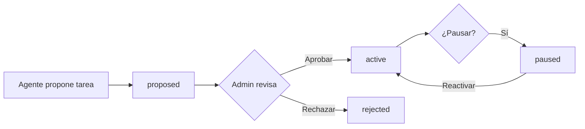

# Nexus AI - Tareas Programadas

> [Inicio](../README.md) > [Nexus AI](vision-general.md) > Tareas Programadas

## Descripción

Los agentes pueden proponer tareas que se ejecuten de forma periódica (cron jobs) usando la herramienta `propose-scheduled-task`. Las tareas propuestas requieren revisión y aprobación del admin antes de activarse.

## Estructura

```typescript
interface NexusScheduledTask {
  id: string
  projectId: string
  name: string
  description: string | null
  cronExpression: string            // Ej: "0 9 * * 1-5" (9am lunes a viernes)
  status: 'active' | 'paused' | 'proposed' | 'rejected'
  taskType: string                  // Tipo/clasificación de la tarea
  payload: Record<string, unknown>  // Datos para la ejecución
  lastRunAt: string | null          // Última ejecución
  nextRunAt: string | null          // Próxima ejecución
  createdAt: string
}
```

## Estados

| Estado | Badge | Descripción |
|--------|-------|-------------|
| `proposed` | Outline (amarillo) | Propuesta por un agente, pendiente de revisión |
| `active` | Default (verde) | Aprobada y ejecutándose según cron |
| `paused` | Secondary (gris) | Pausada temporalmente |
| `rejected` | Destructive (rojo) | Rechazada por el admin |

## Flujo



### Origen de propuestas

Las tareas son propuestas por agentes que tienen habilitada la herramienta `propose-scheduled-task`. Durante una conversación, el agente puede decidir que una acción debería ejecutarse periódicamente y proponer un cron job.

## Página de gestión

**Ruta:** `/admin/nexus/projects/[id]/tasks`
**Archivo:** `app/admin/nexus/projects/[projectId]/tasks/page.tsx` (~243 líneas)

### Organización

Las tareas se agrupan en **3 secciones**:

#### 1. Pendientes de Aprobación

- Borde amarillo izquierdo
- Muestra: nombre, descripción, cron expression (monospace), tipo de tarea
- Botones: Aprobar / Rechazar
- Prioridad visual (aparecen primero)

#### 2. Activas

- Badge verde
- Muestra: nombre, cron expression, tipo de tarea
- **Última ejecución** (`lastRunAt`) con formato de fecha localizado
- **Próxima ejecución** (`nextRunAt`) con formato de fecha localizado

#### 3. Otras (pausadas/rechazadas)

- Display atenuado
- Badge de estado correspondiente

### Tracking de ejecución

```
Última ejecución: 15/02/2026 09:00:00
Próxima: 16/02/2026 09:00:00
```

Las fechas se formatean con locale `es-AR`.

## Ejemplos de tareas

| Tarea | Cron | Descripción |
|-------|------|-------------|
| Reporte diario de ventas | `0 9 * * 1-5` | Generar y enviar reporte cada mañana L-V |
| Seguimiento de leads | `0 14 * * *` | Recordar leads sin contacto hace 3 días |
| Limpieza de datos | `0 2 * * 0` | Archivar registros viejos los domingos |
| Resumen semanal | `0 8 * * 1` | Compilar métricas de la semana anterior |

## Referencia de cron expressions

```
┌──────── minuto (0-59)
│ ┌────── hora (0-23)
│ │ ┌──── día del mes (1-31)
│ │ │ ┌── mes (1-12)
│ │ │ │ ┌ día de la semana (0-7, 0=dom, 7=dom)
│ │ │ │ │
* * * * *
```

Ejemplos comunes:
- `0 9 * * 1-5` → 9:00 AM lunes a viernes
- `0 */4 * * *` → Cada 4 horas
- `30 8 1 * *` → 8:30 AM el primer día de cada mes
- `0 0 * * 0` → Medianoche cada domingo

## API

| Método | Endpoint | Descripción |
|--------|----------|-------------|
| GET | `/api/v1/projects/:id/scheduled-tasks` | Listar tareas |
| POST | `/api/v1/scheduled-tasks/:id/approve` | Aprobar tarea propuesta |
| POST | `/api/v1/scheduled-tasks/:id/reject` | Rechazar tarea propuesta |

### Ejemplo de uso

```typescript
// Listar tareas de un proyecto
const tasks = await nexusApi.listScheduledTasks(projectId)

// Aprobar una tarea propuesta
await nexusApi.approveTask(taskId)

// Rechazar una tarea propuesta
await nexusApi.rejectTask(taskId)
```

## Diferencia con Tareas del workspace

Este sistema de tareas programadas es **completamente independiente** del módulo [Tareas](../modulos/workspace/tareas.md) del workspace:

| Aspecto | Tareas Programadas (Nexus) | Tareas (Workspace) |
|---------|---------------------------|-------------------|
| Origen | Propuestas por agentes IA | Creadas por usuarios en temas |
| Ejecución | Automática (cron) | Manual (usuario completa) |
| Gestión | Admin en panel Nexus | Usuario en workspace |
| Tabla | Nexus Core (externo) | `tema_tasks` (Supabase) |
| Propósito | Automatización recurrente | Checklist de trabajo |

## Archivos clave

| Archivo | Propósito |
|---------|-----------|
| `app/admin/nexus/projects/[projectId]/tasks/page.tsx` | Gestión de tareas programadas |
| `lib/nexus/types.ts` | Tipo `NexusScheduledTask` |
| `lib/nexus/api.ts` | Métodos `listScheduledTasks`, `approveTask`, `rejectTask` |

## Ver también

- [Agentes](agentes.md) — Agentes que proponen tareas
- [Aprobaciones](aprobaciones.md) — Sistema de aprobación similar
- [Proyectos](proyectos.md) — Configuración de herramientas (incluyendo `propose-scheduled-task`)
