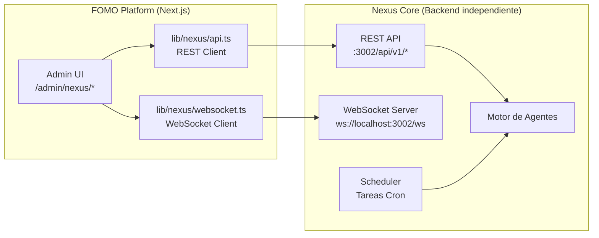
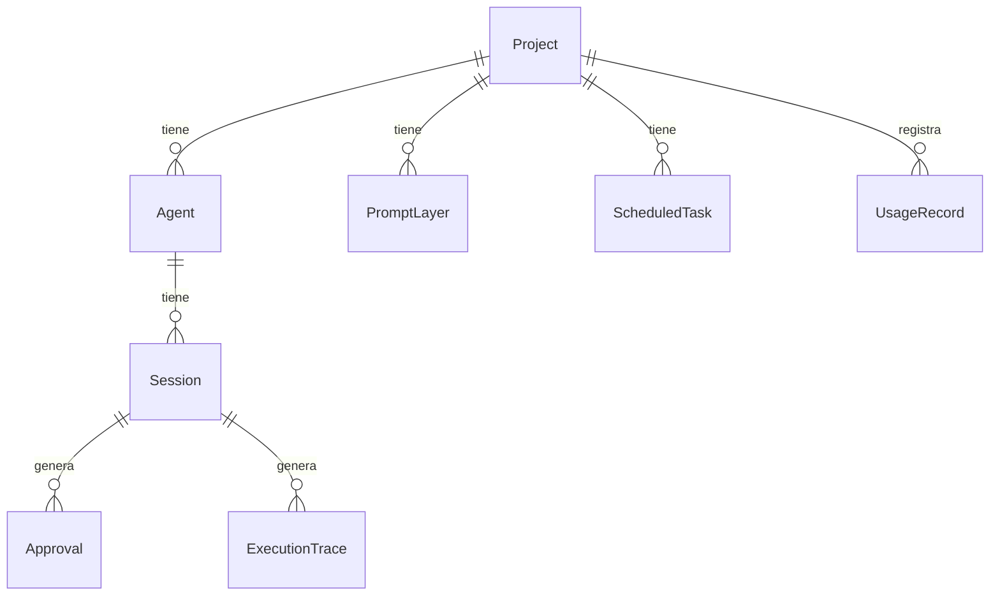

# Nexus AI - Visión General

> [Inicio](../README.md) > Nexus AI > Visión General

## Qué es Nexus AI

Nexus AI es el sistema de **agentes autónomos** de FOMO Platform. Permite crear, configurar y gestionar agentes de IA que pueden ejecutar tareas de forma autónoma, comunicarse en tiempo real, y solicitar aprobación humana para acciones críticas.

## Arquitectura

Nexus tiene una arquitectura de **dos componentes**:



| Componente | Descripción |
|------------|-------------|
| **FOMO Frontend** | UI de gestión en `/admin/nexus/*`. Dashboard, proyectos, agentes, chat, aprobaciones |
| **Nexus Core** | Backend independiente (Node.js). Motor de agentes, API REST, WebSocket, scheduler |

### Comunicación

- **REST API**: CRUD de proyectos, agentes, prompts, tareas, aprobaciones
- **WebSocket**: Chat en tiempo real con agentes, streaming de respuestas, aprobaciones inline

### URL base

```
NEXT_PUBLIC_NEXUS_API_URL = http://localhost:3002  (default)
API prefix: /api/v1
```

## Entidades principales



| Entidad | Descripción |
|---------|-------------|
| **Project** | Contenedor de configuración. Define provider, modelo, herramientas, presupuesto |
| **Agent** | Instancia con un rol específico. Puede tener su propio modelo y herramientas |
| **Session** | Conversación activa entre usuario y agente |
| **PromptLayer** | Capa de prompt (identity, instructions, safety) con versionado |
| **ScheduledTask** | Tarea programada con expresión cron |
| **Approval** | Solicitud de aprobación para una acción del agente |
| **UsageRecord** | Registro de uso: tokens, requests, costos por día |
| **ExecutionTrace** | Traza de ejecución con eventos detallados |

## Páginas del frontend

| Ruta | Descripción |
|------|-------------|
| `/admin/nexus` | Dashboard con stats globales |
| `/admin/nexus/approvals` | Cola de aprobaciones pendientes |
| `/admin/nexus/projects` | Lista de proyectos |
| `/admin/nexus/projects/new` | Wizard para crear proyecto |
| `/admin/nexus/projects/[id]` | Dashboard del proyecto |
| `/admin/nexus/projects/[id]/agents` | Agentes del proyecto |
| `/admin/nexus/projects/[id]/agents/[agentId]/chat` | Chat con agente |
| `/admin/nexus/projects/[id]/tasks` | Tareas programadas |
| `/admin/nexus/projects/[id]/costs` | Tracking de costos |
| `/admin/nexus/projects/[id]/prompts` | Editor de prompts |
| `/admin/nexus/projects/[id]/integrations` | Integraciones |

## Archivos clave

| Archivo | Propósito |
|---------|-----------|
| `lib/nexus/types.ts` | Tipos TypeScript de todas las entidades |
| `lib/nexus/api.ts` | Cliente REST para Nexus Core |
| `lib/nexus/websocket.ts` | Cliente WebSocket |
| `components/nexus/chat-message.tsx` | Renderizado de mensajes de chat |
| `components/nexus/chat-tool-call.tsx` | Visualización de tool calls |
| `components/nexus/chat-approval-card.tsx` | Card de aprobación inline |
| `app/admin/nexus/` | Todas las páginas del frontend |

## Acceso

Solo `super_admin` puede acceder a Nexus AI.

## Ver también

- [Proyectos](proyectos.md) - Configuración de proyectos
- [Agentes](agentes.md) - Agentes autónomos
- [Chat y WebSocket](chat-y-websocket.md) - Comunicación en tiempo real
- [Aprobaciones](aprobaciones.md) - Human-in-the-loop
